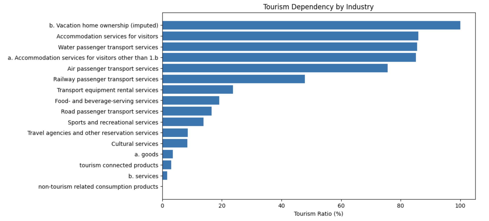

# Tourism Satellite Account Analysis of Japan:
Current focus on tourism consumption, with future analysis covering employment and investment.

## Overview
Tourism is often discussed in terms of visitor numbers and total spending. 
However, understanding the economic structure of tourism requires a broader framework.

This project analyzes Japan’s tourism economy using the Tourism Satellite Account (TSA) for 2023.
The analysis focuses on internal tourism consumption and examines how tourism spending is distributed across different tourism-related products.

## Research Questions
- Which tourism products account for the largest share of tourism consumption in Japan?
- How is tourism spending distributed across tourism-related industries?
- What is the structure of inbound vs domestic tourism consumption?

## Data Source
Japan Tourism Agency (JTA)
Tourism Satellite Account (TSA) Tables 2023

## Project Structure
data/ : TSA tables (Excel)  
notebooks/ : analysis notebooks  
README.md : project overview  

## Future Work
After completing the structural analysis of 2023, 
the project will expand to time-series analysis using historical TSA data.

## Key Findings
- Accommodation services represent the largest component of tourism consumption.
- Food and beverage services also account for a large share of tourism demand.
- Passenger transportation services, including air and railway transport, are major contributors.

## Tourism-dependent industries
Tourism-dependent industries such as accommodation and passenger transport show significantly higher tourism ratios, while retail and cultural services exhibit lower dependence.

Overall, tourism spending in Japan is strongly concentrated in three sectors:
accommodation, food services, and transportation.

Additional analysis compares inbound tourism expenditure and domestic tourism expenditure across tourism-related products.

The results show that domestic tourism accounts for the majority of tourism consumption in Japan.
However, inbound tourism plays an important role in Food and beverage serving and Accommodation sectors.

