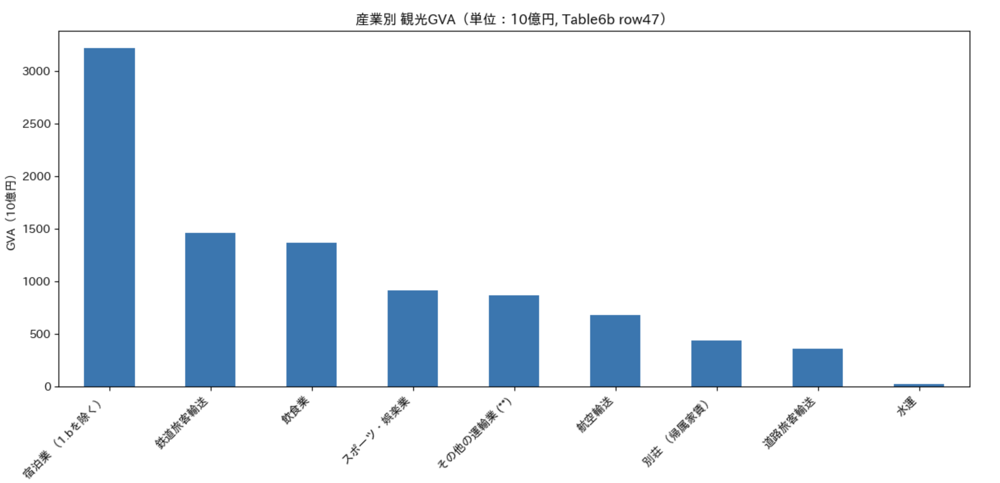

# Tourism Satellite Account Analysis of Japan:
Current focus on tourism consumption, with future analysis covering employment and investment.

## Overview
Tourism is often discussed in terms of visitor numbers and total spending. 
However, understanding the economic structure of tourism requires a broader framework.

This project analyzes Japan’s tourism economy using the Tourism Satellite Account (TSA) for 2023.
The analysis focuses on internal tourism consumption and examines how tourism spending is distributed across different tourism-related products.

## Research Questions
- Which tourism products account for the largest share of tourism consumption in Japan?
- How is tourism spending distributed across tourism-related industries?
- What is the structure of inbound vs domestic tourism consumption?

## Data Source
Japan Tourism Agency (JTA)
Tourism Satellite Account (TSA) Tables 2023

## Project Structure
data/ : TSA tables (Excel)  
notebooks/ : analysis notebooks  
README.md : project overview  

## Future Work
After completing the structural analysis of 2023, 
the project will expand to time-series analysis using historical TSA data.

## Key Findings
High GVA × High Tourism Ratio
→ Core industries heavily dependent on tourism demand (e.g., accommodation)
High GVA × Low Tourism Ratio
→ Supporting industries with a large economic scale but low dependence on tourism
→ Indirect impact of tourism
Low GVA × High Tourism Ratio
→ Small-scale niche industries specializing in tourism
→ Sensitive to fluctuations in foreign demand

## Tourism-dependent industries
The figure below shows the tourism ratio across major tourism-related industries.
Accommodation and passenger transport services show the highest tourism ratios, indicating strong dependence on tourism demand.  
By contrast, cultural and reservation-related services exhibit relatively lower tourism dependence.

### Tourism Dependency by Industry

These results highlight that accommodation and passenger transport are the most tourism-dependent sectors in the economy.

### Tourism GVA by Industry

This chart shows tourism gross value added (GVA) by industry based on Japan's Tourism Satellite Account (Table 6b).  
Accommodation generates the largest share of value, followed by transport and food services, indicating that tourism value creation is concentrated in these sectors.

Overall, tourism spending in Japan is strongly concentrated in three sectors:
accommodation, food services, and transportation.

Additional analysis compares inbound tourism expenditure and domestic tourism expenditure across tourism-related products.

The results show that domestic tourism accounts for the majority of tourism consumption in Japan.
However, inbound tourism plays an important role in Food and beverage serving and Accommodation sectors.

